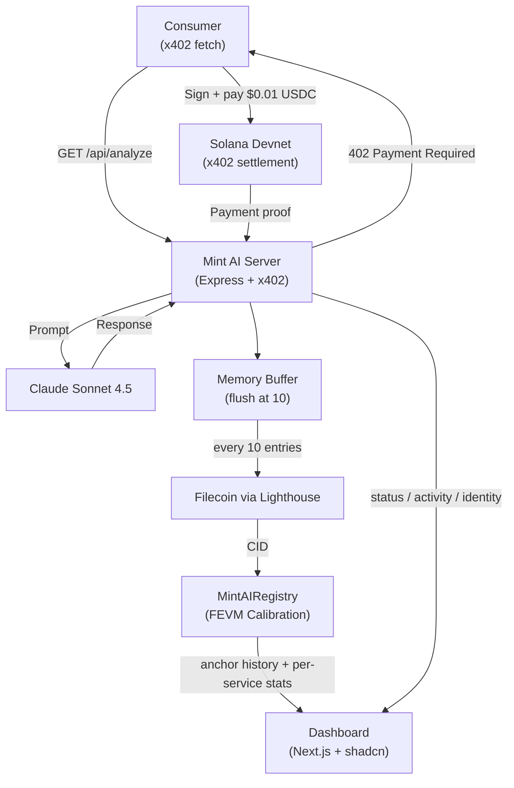

# Mint AI - Self-Sustaining AI Agents with x402 Payments & Filecoin Memory

> AI agents that earn micropayments autonomously, persist their memory on decentralized storage, and maintain verifiable on-chain identity.

This repo is a fresh build of the Mint AI concept with a redesigned smart contract, a shadcn/ui-based dashboard meeting **WCAG 2.1 AA**, and a clean four-package monorepo.

---

## What's inside

```
MintAI/
├── contracts/        Hardhat - MintAIRegistry.sol (FEVM Calibration)
├── server/           Express + x402 + Anthropic + Lighthouse + ethers
├── client/           x402 consumer demo (Solana Devnet payer)
└── dashboard/        Next.js 14 + shadcn/ui + Tailwind 3.4
```

---

## System Architecture



---

## Smart Contract - `MintAIRegistry`

**Network:** Filecoin FEVM Calibration (Chain ID 314159)

Three deliberate design choices:

1. **Append-only memory history** - every flush adds a `MemoryAnchor` to a per-agent array (`cid`, `timestamp`, `entryCount`). No overwrites, full audit trail on chain.
2. **Per-service breakdown** - `ServiceStats` tracks `analyze` / `generate` / `predict` requests and earnings separately, in micro-USD (uint64).
3. **Role-based access** - `admin` + `earningsRecorders` mapping; agents self-anchor their memory; only recorders write earnings.

```solidity
struct Agent      { address wallet; string name; uint64 registeredAt; bool active; }
struct MemoryAnchor { string cid; uint64 timestamp; uint32 entryCount; }
struct ServiceStats {
  uint64 analyzeRequests;  uint64 analyzeEarningsMicro;
  uint64 generateRequests; uint64 generateEarningsMicro;
  uint64 predictRequests;  uint64 predictEarningsMicro;
}
```

Key functions: `registerAgent`, `anchorMemory`, `recordService`, `setReputation`, `grantRecorder`, `getMemoryHistory`, `getAllAgents`.

Tested with Hardhat - 8 unit tests covering registration, double-registration, anchor history, per-service stats, recorder access control, reputation cap, and unregistered-agent guards.

---

## Server - `server/`

Express + TypeScript. Routes:

| Endpoint | Price | Description |
|---|---|---|
| `GET /api/analyze?query=…` | $0.01 USDC | Claude data analysis |
| `GET /api/generate?prompt=…` | $0.005 USDC | Claude content generation |
| `GET /api/predict?topic=…` | $0.02 USDC | Market prediction |
| `GET /api/status` | free | Agent stats, per-service totals, uptime |
| `GET /api/identity` | free | On-chain identity, reputation, breakdown |
| `GET /api/storage/memories` | free | Local + on-chain memory anchors |
| `GET /api/storage/memory/:cid` | free | Fetch a batch from Lighthouse gateway |
| `POST /api/storage/flush` | free | Manual flush trigger |
| `GET /api/activity` | free | Live event feed (filterable by `kind`) |
| `POST /api/playground/{analyze,generate,predict,chat}` | free | Demo mode (no x402) |

After each paid call, the server:

1. Adds a memory entry tagged with `serviceKind`.
2. Updates the in-memory wallet ledger.
3. Pushes an event to the activity log.
4. Fires a non-blocking `recordService(agent, kind, micro)` to MintAIRegistry.
5. When the buffer hits 10 entries → uploads to Filecoin via Lighthouse → calls `anchorMemory(cid, entryCount)` on chain.

---

## Client - `client/`

x402 consumer demo. Uses `@x402/fetch` + `@x402/svm` + `@solana/kit` to sign payments transparently:

```ts
const client = new x402Client().register("solana:*", new ExactSvmScheme(svmSigner));
export const fetchWithPayment = wrapFetchWithPayment(fetch, client);
```

`npm run consume` calls all three paid endpoints and prints a per-service spend summary (total: $0.035 USDC).

---

## Dashboard - `dashboard/`

**Stack:** Next.js 14, React 18, Tailwind 3.4, shadcn/ui (new-york style, slate base), Chart.js, Sonner, lucide-react.

### Pages

| Route | Purpose |
|---|---|
| `/` | KPI cards, cumulative earnings chart, agent identity card, service breakdown |
| `/memory` | Filecoin memory batches + on-chain anchor history; manual flush button |
| `/identity` | Reputation tier, per-service breakdown read from chain |
| `/activity` | Live event feed with filter tabs |
| `/playground` | Free Claude demo — analyze, generate, predict tabs |

### WCAG 2.1 AA features

- **1.4.3 Contrast** - design tokens deliberately tuned (`foreground` 16.8:1, `muted-foreground` 6.6:1, `border` 3.2:1).
- **2.1.1 Keyboard / 2.4.7 Focus visible** - all interactions reachable via Tab; 2px focus ring with offset on every focusable element via shadcn primitives.
- **2.4.1 Bypass blocks** - "Skip to main content" link, first child of `<body>`, becomes visible on focus.
- **4.1.2 Name/Role/Value** - semantic landmarks (`<header>`, `<nav>`, `<aside>`, `<main>`); aria labels on icon-only buttons; ARIA-current on active nav links.
- **1.3.1 Info & relationships** - tables use `<th scope="col">` and `<caption class="sr-only">`; one `<h1>` per page; logical heading descent.
- **1.4.10 Reflow** - works at 320px width via mobile dropdown nav.
- **3.3.2 Labels** - `<Label htmlFor>` ↔ `<Textarea id>` pairs throughout the playground.

---

## Setup

### Prerequisites

- Node.js ≥ 20
- A Solana Devnet wallet with SOL + USDC (for the agent + the consumer)
- A Filecoin Calibration wallet with tFIL (for contract deploys + tx fees)
- Anthropic API key
- Lighthouse Storage API key

### 1. Deploy the contract

```bash
cd contracts
cp .env.example .env             # set PRIVATE_KEY (Filecoin wallet, 0x-prefixed)
npm install
npm run compile
npm test                         # 8 tests should pass
npm run deploy                   # prints MINTAI_CONTRACT_ADDRESS=0x…
```

### 2. Start the server

```bash
cd ../server
cp .env.example .env             # fill in everything; paste MINTAI_CONTRACT_ADDRESS
npm install
npm run dev                      # http://localhost:4022
```

Required env:

```
SVM_ADDRESS, SVM_PRIVATE_KEY     # Solana wallet earning x402 payments
ANTHROPIC_API_KEY
LIGHTHOUSE_API_KEY               # optional — disables Filecoin if missing
FEVM_PRIVATE_KEY                 # 0x-prefixed Filecoin wallet
MINTAI_CONTRACT_ADDRESS          # from step 1
AGENT_NAME=MintAI-Genesis        # any name
PORT=4022
```

### 3. Run the consumer demo

```bash
cd ../client
cp .env.example .env             # different SVM_PRIVATE_KEY (the payer)
npm install
npm run consume                  # 3 paid calls, total $0.035 USDC
```

### 4. Start the dashboard

```bash
cd ../dashboard
cp .env.example .env.local       # NEXT_PUBLIC_MINTAI_SERVER_URL=http://localhost:4022
npm install
npm run dev                      # http://localhost:3000
```

---

## Networks

| Network | Use | RPC / Gateway |
|---|---|---|
| Solana Devnet | x402 settlement | (via x402 facilitator) |
| Filecoin FEVM Calibration | MintAIRegistry deploy | `api.calibration.node.glif.io/rpc/v1` |
| Filecoin (Lighthouse) | Memory storage | `gateway.lighthouse.storage` |

---

## Verification

| | Command |
|---|---|
| Contract tests | `cd contracts && npm test` (8 passing) |
| Server type-check | `cd server && npx tsc --noEmit` |
| Client type-check | `cd client && npx tsc --noEmit` |
| Dashboard build | `cd dashboard && npm run build` |
| Dashboard a11y | run `npx @axe-core/cli http://localhost:3000` against each route |

---

## License

MIT.
